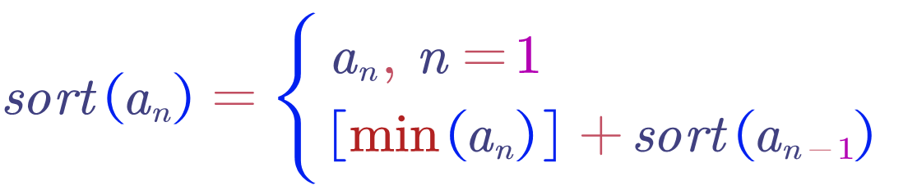
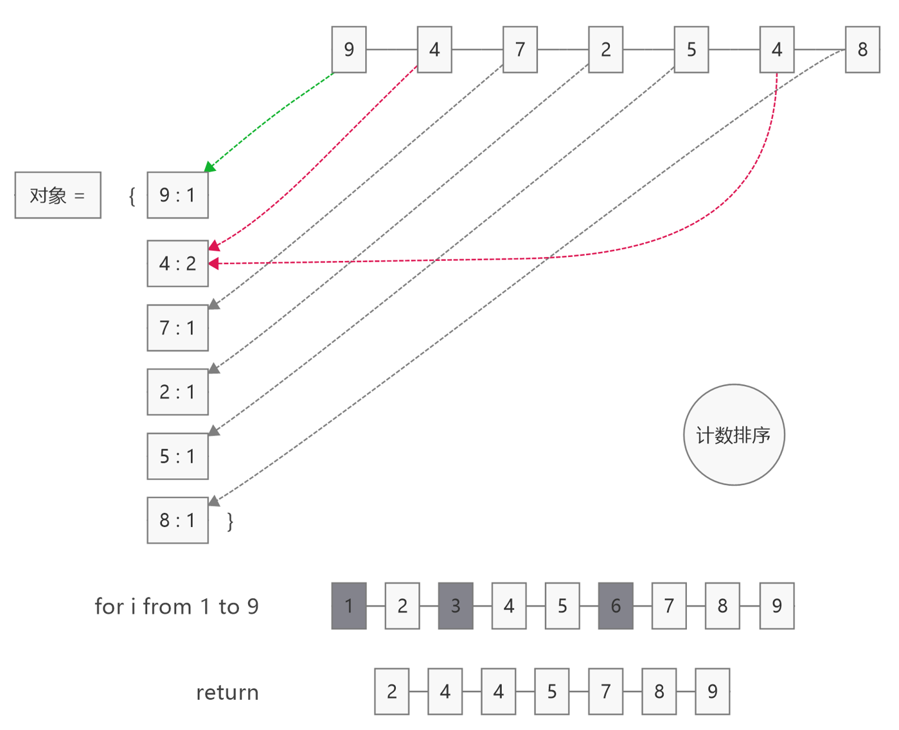
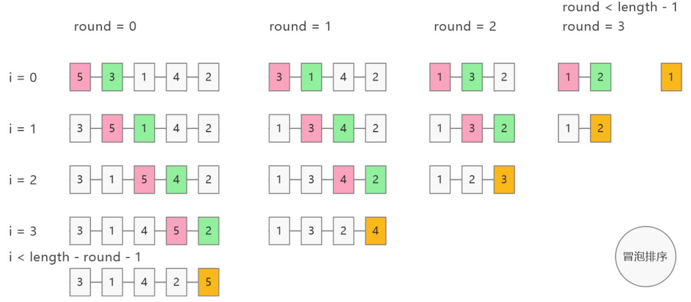

## 选择排序代码


```JavaScript
selectSort = arr => {
    if(arr.length <= 1) return arr
    for(let i=0; i<arr.length-1; i++){ // 一共选择 length - 1 次，因为最后一次只有一个元素不用选
      let minIndex = i // 假设第一个是最小的
      for(let k=i+1; k<arr.length; k++){
          if(arr[k]<arr[i]){
              minIndex = k // 第 k 个比第一个小，就用 minIndex 记住 k
          }
      }
      [arr[i], arr[minIndex]] =  [arr[minIndex], arr[i]] // 交换 arr[i] 和 arr[minIndex] 的值
    }
    return arr
}

selectSort([3,2,1])
// [1, 2, 3]
selectSort([1,1,1])
// [1, 1, 1]
```

## 计数排序代码


```JavaScript
countSort = arr => {
    if(arr.length <= 1) return arr
    let hashTable = {} // 用于计数的对象
    let max = arr[0] // 用于记录最大值，假设第一个最大
    for(let i=0; i<arr.length; i++){
        const n = arr[i]
        hashTable[n] = hashTable[n] === undefined ? 1 : hashTable[n]+1 // n 对应的 value 要么置为1，要么加1
        if(n>max) max = n // 更新最大值
    }
    const result = [] // 要返回的数组
    console.log('hashTable')
    console.log(hashTable)
    for(let k=1; k<=max; k++){ // 正整数数组从1开始
        if(hashTable[k] !== undefined){ // hashTable[k] 表示数字出现的次数
            for(let m=0; m<hashTable[k]; m++){
                result.push(k) // 出现几次，就 push 几次
            }
        }
    }
    return result
}

countSort([3,2,1])
// [1, 2, 3]
countSort([1,1,1])
// [1, 1, 1]
```

## 冒泡排序代码



```JavaScript
bubbleSort = arr => {
  const {length} = arr
  for(let r=0; r<length-1; r++){
    for(let i=0; i<length-r-1; i++){
      if(arr[i]>arr[i+1]){
        [arr[i], arr[i+1]] = [arr[i+1], arr[i]] 
      }
    }
  }
  return arr
}


bubbleSort([3,2,1])
// [1, 2, 3]
bubbleSort([1,1,1])
// [1, 1, 1]
```

## 插入排序代码

```JavaScript
insertSort = arr => {
  if(arr.length<=1)return arr
  for(let s=1; s<arr.length; s++){
    const n = arr[s] // 记住n
    let i // i要在for循环之后使用
    for(i=s-1; i>=0; i--){
      //比 n 大的数字往后挪了一位
      if(arr[i]>n) arr[i+1] = arr[i]
      // 遇到比 n 小的就中断循环
      else if(arr[i]<=n) break
    }
    arr[i+1] = n
  }
  return arr
}


insertSort([3,2,1])
// [1, 2, 3]
insertSort([1,1,1])
// [1, 1, 1]
```